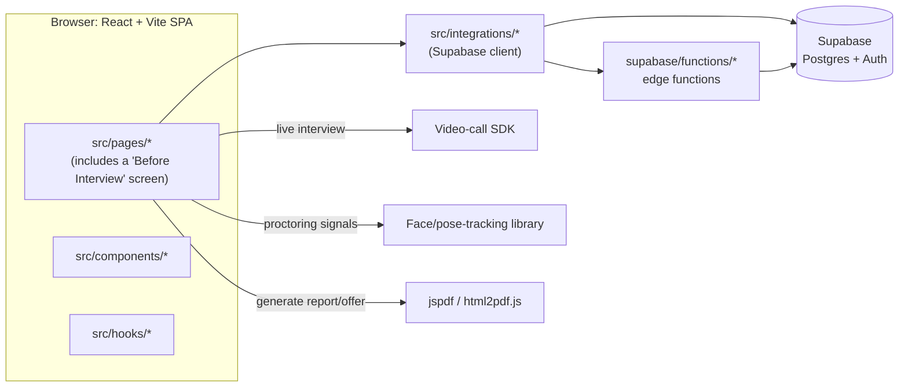

# Architecture

[← Back to README](../README.md)

**Project:** HireZap — AI Powered Recruitment Platform
**Live app:** https://hackmysrank.vercel.app/ · **Repository:** https://github.com/seervisuman68-commits/hackmysrank (branch `main`)

This is based on the repository's folder structure and `package.json`, and on recent commit messages. The contents of most individual files were not read, so treat the flow and API sections as a working sketch, not a confirmed spec — see [Not Covered](#not-covered).

## System Diagram

## Components

| Component | Responsibility | Tech | Code location |
|---|---|---|---|
| Pages | Candidate and HR-facing screens, including a "Before Interview" step | React (TypeScript), Vite | `src/pages/` |
| Components | Shared UI building blocks | React, shadcn/ui, Tailwind | `src/components/` |
| Hooks | Shared client-side logic | React hooks | `src/hooks/` |
| Integrations | Client wiring to Supabase (and possibly the video SDK) | `@supabase/supabase-js` and similar | `src/integrations/` |
| Shared utilities | Helper functions used across the app | TypeScript | `src/lib/` |
| Edge functions | Server-side logic (very likely including the AI scoring) | Supabase Edge Functions | `supabase/functions/` |
| Database schema | Tables and structure for candidates, applications, interviews, scores | SQL migrations | `supabase/migrations/` |
| Tests | Automated tests | `<framework not confirmed>` | `src/test/` |

## Data Model

No schema was read for this document. `supabase/migrations/` almost certainly defines tables for at least: users/roles (candidate vs HR), applications, interviews and a candidate score. **Not confirmed** — read the migration files to fill this in.

## Key APIs

Not confirmed. Client calls likely go through `src/integrations/` to Supabase directly (table reads/writes via the Supabase client) and to `supabase/functions/` for anything needing server-side logic (most importantly, whatever computes the candidate AI score). Read `src/integrations/` and `supabase/functions/` to fill in the real endpoints.

## Tech Stack

| Layer | Choice | Why |
|---|---|---|
| Frontend | React + Vite + TypeScript, shadcn/ui, Tailwind | `<not recorded — ask the team>` |
| Forms & validation | `react-hook-form`, `zod` | `<not recorded>` |
| Live interview | A video-call SDK (React) | Needed for a live, on-screen interview |
| Proctoring signal | A face/pose-tracking library | Powers the tab-switch/attention signal referenced in recent commits |
| Document generation | `jspdf`, `html2pdf.js` | Likely used for a candidate report or offer letter |
| Backend / database | Supabase (Postgres, Auth, Edge Functions) | Hosted backend with no server to run |
| Deployment | Vercel | Live app at https://hackmysrank.vercel.app/ |

## Not Covered

Individual files under `src/pages/`, `src/components/`, `src/hooks/`, `src/integrations/`, `src/lib/`, and everything in `supabase/functions/` and `supabase/migrations/` were not opened for this document. Before submitting, open those folders (a directory screenshot or pasted file list works well) and fill in: the real page names and flow, the actual API/DB calls, the database schema, and exactly how the candidate AI score is computed.
